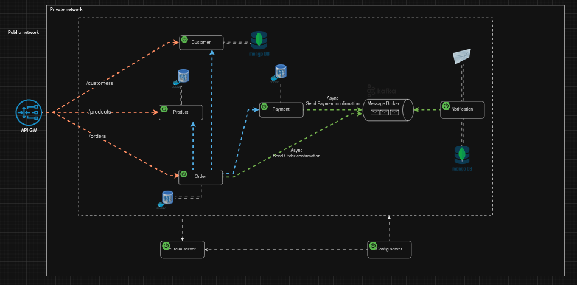
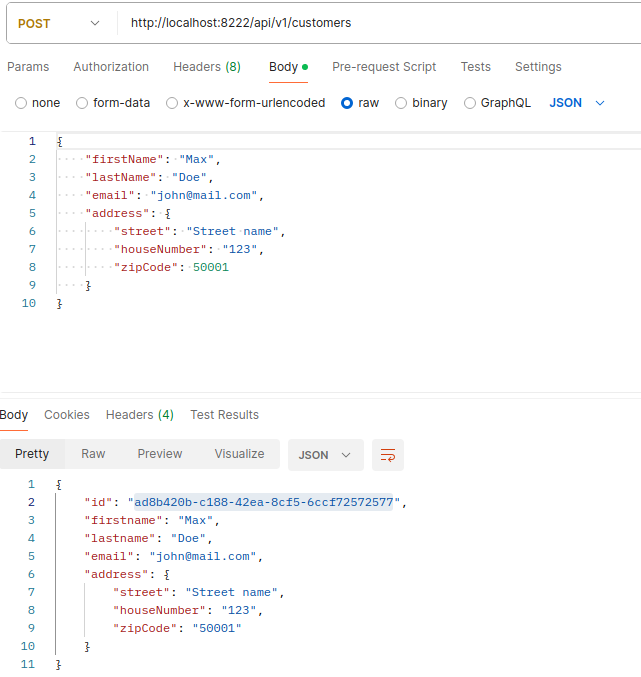
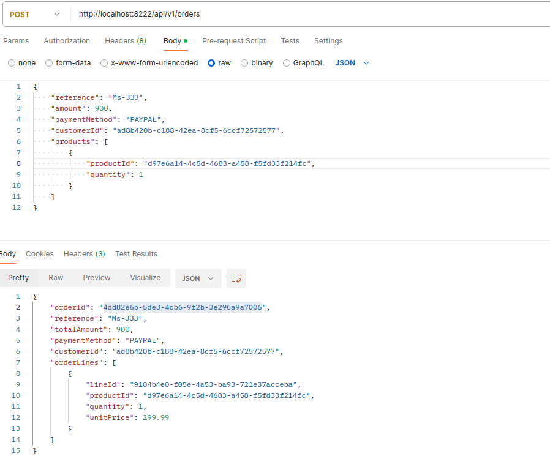
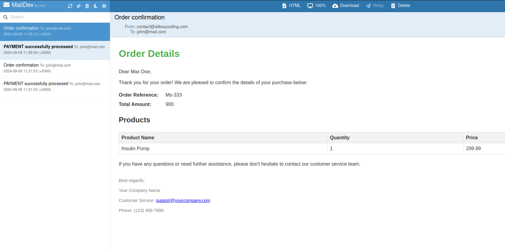

<div style="display: flex; justify-content: space-between; align-items: center;">
  <div>
    <a href="./LICENSE">
      
    </a>
  </div>
  <div>
    <a href="https://www.linkedin.com/in/nazar-zhuhan">
      
    </a>
  </div>
</div>

[linkedin-shield]: https://img.shields.io/badge/LinkedIn-Profile-blue?logo=linkedin

<!-- TABLE OF CONTENTS -->
<details>
  <summary>Table of Contents</summary>
  <ol>
    <li>
      <a href="#about-the-project">About The Project</a>
      <ul>
        <li><a href="#built-with">Built With</a></li>
      </ul>
    </li>
    <li>
      <a href="#getting-started">Getting Started</a>
      <ul>
        <li><a href="#prerequisites">Prerequisites</a></li>
        <li><a href="#installation">Installation</a></li>
      </ul>
    </li>
    <li><a href="#usage">Usage</a></li>
    <li><a href="#roadmap">Roadmap</a></li>
    <li><a href="#contributing">Contributing</a></li>
    <li><a href="#license">License</a></li>
    <li><a href="#contact">Contact</a></li>
    <li><a href="#acknowledgments">Acknowledgments</a></li>
  </ol>
</details>


<!-- ABOUT THE PROJECT -->
## About The Project




[//]: # ([![Product Name Screen Shot]&#40;./screenshots/img.png&#41;]&#40;./screenshots/img.png&#41;)

---


## About The Project

This project is focused on digitizing and streamlining the operations of an e-commerce business that manages a variety of products. The system facilitates customer interactions by allowing them to place orders from the product list. Upon successful payment, the system automatically sends email notifications to customers, confirming the payment or informing them of any payment issues.

The project implements modern microservices architecture to ensure scalability and efficiency.  This application is designed to enhance operational efficiency and support the growth of the e-commerce business.

---

### Key Features
Key components include services for managing customers, orders, payments, and notifications. Technologies such as Spring Boot, Docker, and Kafka are utilized to create a robust, distributed system. Additionally, service discovery - name resolution, API Gateway - cross-cutting concerns, and Configuration server - centralised management of config files are integrated to ensure seamless communication across services.

### Built With

* [![Spring Boot][Spring-Boot]][Spring-Boot-url]
* [![Spring Cloud][Spring-Cloud]][Spring-Cloud-url]
* [![Eureka][Eureka]][Eureka-url]
* [![Kafka][Kafka]][Kafka-url]
* [![PostgreSQL][PostgreSQL]][PostgreSQL-url]
* [![MongoDB][MongoDB]][MongoDB-url]

[Spring-Boot]: https://img.shields.io/badge/Spring%20Boot-3.3.2-green
[Spring-Boot-url]: https://spring.io/projects/spring-boot

[Spring-Security]: https://img.shields.io/badge/Spring%20Security-6.3.1-blue
[Spring-Security-url]: https://spring.io/projects/spring-security

[Spring-Cloud]: https://img.shields.io/badge/Spring%20Cloud-4.1.5-blue
[Spring-Cloud-url]: https://spring.io/projects/spring-cloud

[Eureka]: https://img.shields.io/badge/Eureka-4.1.3-orange
[Eureka-url]: https://spring.io/projects/spring-cloud-netflix

[Kafka]: https://img.shields.io/badge/Kafka-3.2.2-yellow
[Kafka-url]: https://kafka.apache.org/

[MySQL]: https://img.shields.io/badge/MySQL-8.3.0-blue
[MySQL-url]: https://www.mysql.com/

[PostgreSQL]: https://img.shields.io/badge/PostgreSQL-gray
[PostgreSQL-url]: https://www.postgresql.org/

[MongoDB]: https://img.shields.io/badge/MongoDB-4.4.6-green
[MongoDB-url]: https://www.mongodb.com/

[Loki]: https://img.shields.io/badge/Loki-main-blue
[Loki-url]: https://grafana.com/oss/loki/

[Grafana]: https://img.shields.io/badge/Grafana-main-blue
[Grafana-url]: https://grafana.com/

[Prometheus]: https://img.shields.io/badge/Prometheus-2.43.1-blue
[Prometheus-url]: https://prometheus.io/

[Tempo]: https://img.shields.io/badge/Tempo-2.2.2-blue
[Tempo-url]: https://grafana.com/oss/tempo/

[Resilience4j]: https://img.shields.io/badge/Resilience4j-3.1.2-yellow
[Resilience4j-url]: https://resilience4j.readme.io/


## Getting Started

This guide will help you set up and run the project locally using Docker. Follow these steps to get your development environment up and running.

### Prerequisites

Make sure you have the following installed:

* [Docker](https://www.docker.com/get-started)
* [Docker Compose](https://docs.docker.com/compose/install/)

### Installation & Usage

1. **Clone the repository**

   ```sh
   git clone https://github.com/KnOMM/e-commerce-app
   ```

2. **Navigate to the project directory**

   ```sh
   cd e-commerce-app
   ```

3. **Build and start the Docker containers in background**

   ```sh
   docker-compose up -d
   ```

   This command will build the Docker images (if needed) and start all the services defined in your `docker-compose.yml` file.

4. **Run applications in order:**
    Config-service -> Discover-service -> other services -> Gateway-service
5. **Create customers and order products**



6. **Check email on `localhost:1080`**

7. **Check logs**

   To view the logs of your running services, you can use:

   ```sh
   docker-compose logs
   ```
8. **Stop the containers**

   When you're done, stop the containers with:

   ```sh
   docker-compose down -v
   ```

---

<!-- CONTRIBUTING -->
## Contributing

Contributions are what make the open source community such an amazing place to learn, inspire, and create. Any contributions you make are **greatly appreciated**.

If you have a suggestion that would make this better, please fork the repo and create a pull request. You can also simply open an issue with the tag "enhancement".
Don't forget to give the project a star! Thanks again!

1. Fork the Project
2. Create your Feature Branch (`git checkout -b feature/AmazingFeature`)
3. Commit your Changes (`git commit -m 'Add some AmazingFeature'`)
4. Push to the Branch (`git push origin feature/AmazingFeature`)
5. Open a Pull Request


<!-- LICENSE -->
## License

Distributed under the MIT License. See `LICENSE` for more information.


---

<!-- CONTACT -->
## Contact

Nazar Zhuhan - nazarzhuhan@gmail.com

Project Link: [https://github.com/KnOMM/e-commerce-app](https://github.com/KnOMM/e-commerce-app)


<!-- ACKNOWLEDGMENTS -->
## Acknowledgments

* [Bouali Ali](https://www.youtube.com/watch?v=jdeSV0GRvwI) - tutorial
* [WebClient Testing](https://www.youtube.com/watch?v=0jyKgEz0Yn8)
* [Testcontainers](https://www.youtube.com/watch?v=erp-7MCK5BU)
* [README.md template](https://github.com/othneildrew/Best-README-Template/blob/main/BLANK_README.md)

---


[contributors-shield]: https://img.shields.io/github/contributors/github_username/repo_name.svg?style=for-the-badge
[contributors-url]: https://github.com/github_username/repo_name/graphs/contributors
[forks-shield]: https://img.shields.io/github/forks/github_username/repo_name.svg?style=for-the-badge
[forks-url]: https://github.com/github_username/repo_name/network/members
[stars-shield]: https://img.shields.io/github/stars/github_username/repo_name.svg?style=for-the-badge
[stars-url]: https://github.com/github_username/repo_name/stargazers
[issues-shield]: https://img.shields.io/github/issues/github_username/repo_name.svg?style=for-the-badge
[issues-url]: https://github.com/github_username/repo_name/issues
[license-shield]: https://img.shields.io/github/license/github_username/repo_name.svg?style=for-the-badge
[license-url]: https://github.com/github_username/repo_name/blob/master/LICENSE.txt
[linkedin-shield]: https://img.shields.io/badge/-LinkedIn-black.svg?style=for-the-badge&logo=linkedin&colorB=555
[linkedin-url]: https://linkedin.com/in/linkedin_username
[product-screenshot]: images/screenshot.png
[Next.js]: https://img.shields.io/badge/next.js-000000?style=for-the-badge&logo=nextdotjs&logoColor=white
[Next-url]: https://nextjs.org/
[React.js]: https://img.shields.io/badge/React-20232A?style=for-the-badge&logo=react&logoColor=61DAFB
[React-url]: https://reactjs.org/
[Vue.js]: https://img.shields.io/badge/Vue.js-35495E?style=for-the-badge&logo=vuedotjs&logoColor=4FC08D
[Vue-url]: https://vuejs.org/
[Angular.io]: https://img.shields.io/badge/Angular-DD0031?style=for-the-badge&logo=angular&logoColor=white
[Angular-url]: https://angular.io/
[Svelte.dev]: https://img.shields.io/badge/Svelte-4A4A55?style=for-the-badge&logo=svelte&logoColor=FF3E00
[Svelte-url]: https://svelte.dev/
[Laravel.com]: https://img.shields.io/badge/Laravel-FF2D20?style=for-the-badge&logo=laravel&logoColor=white
[Laravel-url]: https://laravel.com
[Bootstrap.com]: https://img.shields.io/badge/Bootstrap-563D7C?style=for-the-badge&logo=bootstrap&logoColor=white
[Bootstrap-url]: https://getbootstrap.com
[JQuery.com]: https://img.shields.io/badge/jQuery-0769AD?style=for-the-badge&logo=jquery&logoColor=white
[JQuery-url]: https://jquery.com 